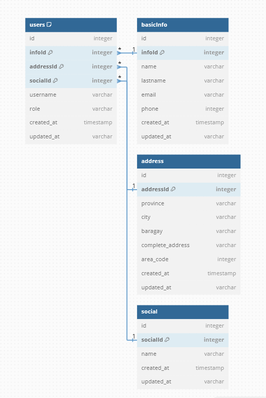

<h1>Changes and Additional in Portfolio App</h1>

Changes
- [ ] Info - Add TailwindCSS, Create and Add a Link for Portfolio PDF and Add more infomation or personal description
- [ ] Stacks - Add TailwindCSS, Make 2 items in a row
- [ ] Navbar - Github button to new tab 
- [ ] Footer - Fix Links on Mobile

Remake
- [ ] Vuejs3/Vite
- [ ] TailwindCSS
- [ ] Dark Mode

## Sample E-Commerce Infra

> sample flow of an ecommerce, vuejs3 props-components driven data connection and separation

 

## userInterfaceView

> sample flow of an ecommerce, vuejs3 props-components driven data connection and separation

## relational for users

> Table users {
  id integer 
  infoId integer [primary key]
  addressId integer [primary key]
  socialId integer [primary key]
  username varchar
  role varchar
  created_at timestamp
  updated_at varchar
}

> Table basicInfo { 
  id integer 
  infoId integer [primary key]
  name varchar
  lastname varchar
  email varchar
  phone integer
  created_at timestamp
  updated_at varchar
}

> Table address {
  id integer 
  addressId integer [primary key]
  province varchar
  city varchar 
  baragay varchar
  complete_address varchar
  area_code integer
  created_at timestamp
  updated_at varchar
}

> Table social {
  id integer 
  socialId integer [primary key]
  name varchar
  created_at timestamp
  updated_at varchar
}

> Ref: users.infoId > basicInfo.infoId
> Ref: users.addressId > address.addressId
> Ref: users.socialId > social.socialId

### copy and paste here `https://dbdiagram.io/d`
